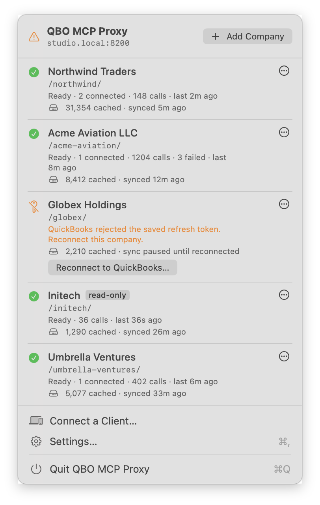
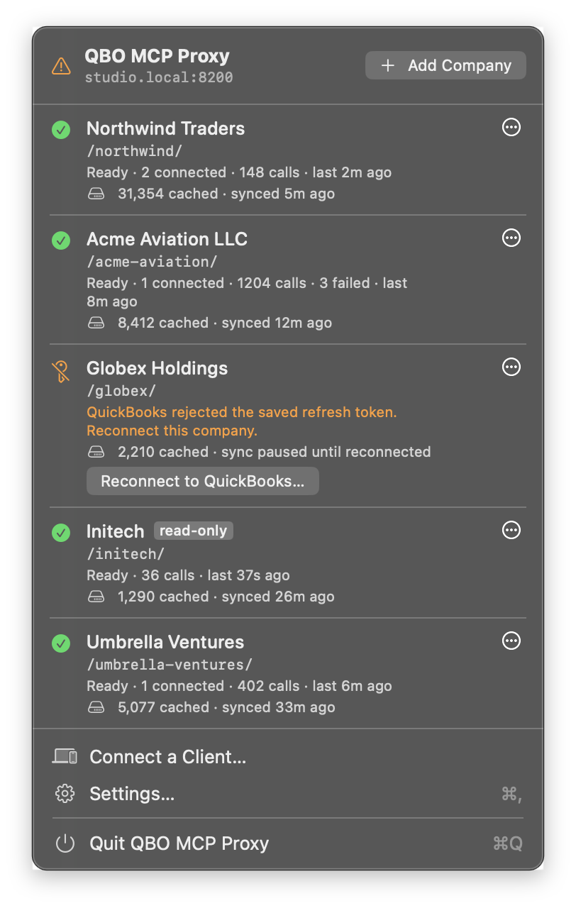
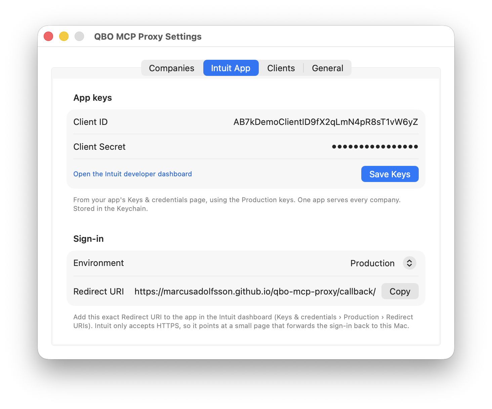
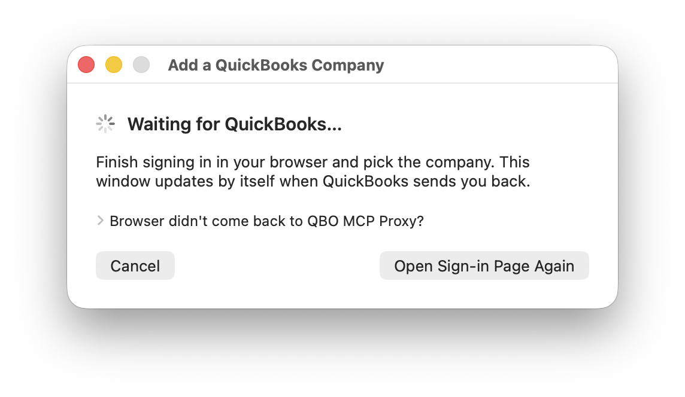
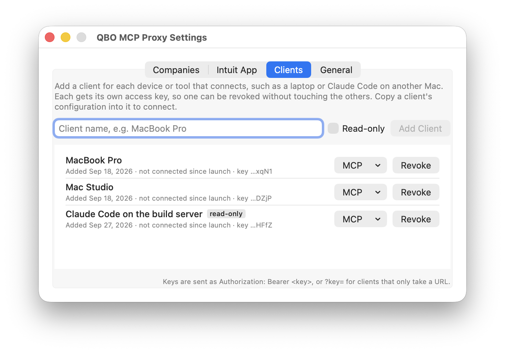
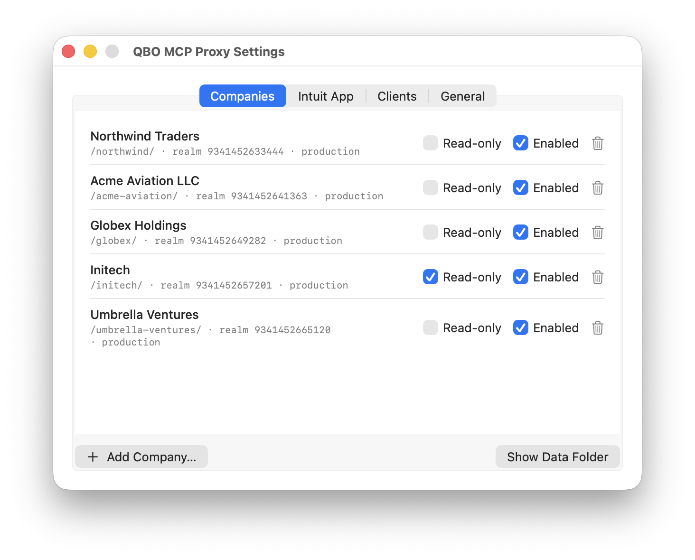
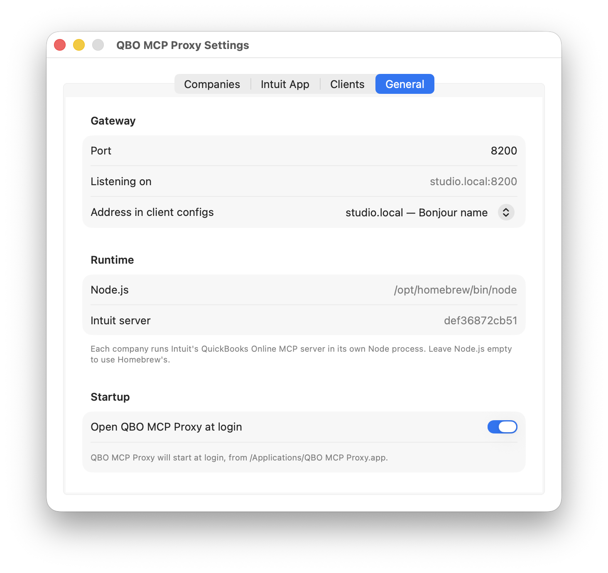

# QBO MCP Proxy

**Your QuickBooks Online companies, served to Claude and any other MCP client from your Mac's
menu bar.** Add a company by signing in to QuickBooks. Connect a client by pasting one command.
Nothing to host and no config files to edit.

<p align="center">
  
  &nbsp;
  
</p>

## Why a proxy?

Intuit publishes an official
[QuickBooks Online MCP server](https://github.com/intuit/quickbooks-online-mcp-server) with full
read/write access to the Accounting API: about 140 tools. On its own, though, it's a local program
that serves one company to one client, set up by hand. QBO MCP Proxy runs it for you and removes
those limits:

1. **Multiple companies.** Intuit's server connects to exactly one QuickBooks company. The proxy
   runs one per company and gives each its own address (`/acme/`, `/globex/`, …), so Claude can work
   across all your books and you name the company in plain language.
2. **Multiple clients.** Intuit's server accepts a single connection, ever: a second client can't
   connect, and a laptop that sleeps and reconnects knocks it over. The proxy keeps each company's
   server running and shares it safely between any number of clients (your laptop, your desktop,
   Claude Code, scheduled automations), all on one QuickBooks sign-in per company.
3. **Easy to set up.** No Intuit OAuth Playground, no copying tokens into config files, no server
   to host. Install the app, paste your Intuit app keys once, then **Add Company** is a QuickBooks
   sign-in and connecting a client is one copied command. Tokens renew by themselves; if one ever
   expires, the menu shows a Reconnect button.

## Setup takes about five minutes

### 1. Install

Download `QBO-MCP-Proxy.dmg` from the
[latest release](https://github.com/marcusadolfsson/qbo-mcp-proxy/releases/latest), open it, and
drag **QBO MCP Proxy** to Applications. It's notarized by Apple and runs on Apple Silicon and Intel
Macs with macOS 14 or later.

It also needs [Node.js](https://nodejs.org) 18 or later, which runs Intuit's server. The easiest
way to get it is [Homebrew](https://brew.sh), the Mac's package manager. If you don't have Homebrew
yet, open Terminal and run:

```bash
/bin/bash -c "$(curl -fsSL https://raw.githubusercontent.com/Homebrew/install/HEAD/install.sh)"
```

It asks for your Mac password and may install Xcode's command line tools. When it finishes, run the
two commands it prints under **Next steps** (they add `brew` to your shell), then install Node:

```bash
brew install node
```

Prefer not to use Homebrew? The installer from [nodejs.org](https://nodejs.org/en/download) works
too. If Node is missing or too old, the menu says so, with a download link, and companies start by
themselves once it's installed.

Turn on **Open QBO MCP Proxy at login** in Settings › General and it's always there.

Or build it yourself (needs Xcode's command line tools):

```bash
git clone https://github.com/marcusadolfsson/qbo-mcp-proxy.git
cd qbo-mcp-proxy
make install
```

### 2. Paste your Intuit app keys, once

Create an app at [developer.intuit.com](https://developer.intuit.com/app/developer/dashboard)
(QuickBooks Online and Payments, scope `com.intuit.quickbooks.accounting`). From its
**Keys & credentials › Production** page:

- copy the **Client ID** and **Client Secret** into Settings › Intuit App, and
- add the **Redirect URI** that Settings shows (there's a Copy button):
  `https://marcusadolfsson.github.io/qbo-mcp-proxy/callback/`

The keys go in the Keychain. One Intuit app serves every company you add.



### 3. Add a company: click, sign in, pick it

Click **Add Company**. QuickBooks opens in your browser; sign in and choose the company. That's
it. The app receives its access, reads its name, gives it a URL like `/acme-aviation/`, and starts
serving it. Repeat for each company.



### 4. Connect a client: copy, paste

**Connect a Client…** opens Settings › Clients. Add one for each device or tool (a laptop,
Claude Code on another Mac, a build server). Each gets its own access key, and its **MCP** menu
copies a ready-to-paste setup for every company:

```bash
claude mcp add --transport http -s user qbo-acme-aviation \
  http://studio.local:8200/acme-aviation/mcp --header "Authorization: Bearer qbo_…"
```



Every connection needs a key, including apps on the Mac itself. Revoking one client cuts off
only that client. Tick **Read-only** when adding a client that should never change the books, like
an exploratory or scheduled session: it sees no create, update or delete tools and can't call them.

## Day to day

- **Glanceable status.** The menu shows each company's state, connected clients and call
  counts. The menu bar icon turns into a warning when something needs you.
- **Expired tokens fix in one click.** If QuickBooks stops accepting a company's token, that
  company shows **Reconnect to QuickBooks…**. Sign in again and it's back, with the same URL.
- **Read-only companies.** Tick Read-only in Settings › Companies to hide every create, update
  and delete tool for that company.
- **Survives sleep and restarts.** The `/mcp` endpoint is stateless, so a laptop that slept or a
  client that restarted just carries on. Companies whose server crashes restart by themselves.



> ⚠️ **Writes are live.** The tools create, update and delete in the real books of the company
> you connect. Use Read-only for companies you only want to query.

## Read-cache: all-history search without the token bill

Every company also gets a local SQLite copy of its books, synced hourly, and three read-only
tools on its endpoint. In real use, a vendor lookup that took a 724 KB `fetchAll` dump came back
from `cache_search` as 60 rows in 10 KB: about 70 times less for the model to read.

| Tool | What it's for |
|---|---|
| `cache_search` | "Every Staples charge since 2019", "the $612.40 payment": compact rows and a total count instead of a `fetchAll` dump. Filters: text, payee, account, dates, amounts, type. |
| `cache_sql` | One read-only `SELECT` over `txns`, `txn_lines`, `accounts`, `vendors`, `customers`, `items`, `classes`. |
| `cache_status` | Freshness per entity type, so a client can tell stale from broken. |
| `cache_sync_now` | Refresh now instead of waiting for the hour, e.g. right after posting a batch you want to check. One run per company at a time. |

- **Current and complete.** Each hourly run fetches what changed since the last one, and Intuit's
  change feed catches deletions, which queries never return. Voided and deleted transactions are
  hidden unless asked for.
- **Read-only, one company per file.** `cache_sql` on `/acme/mcp` can only open `acme.db`, read-only;
  writes, `ATTACH` and `PRAGMA` are refused. QuickBooks stays the source of truth, and all writes go
  through the normal tools.
- **Looked after.** Each company in the menu shows how much is cached and when it last synced.
  Daily backups (kept five days), a log of every run, and **Sync Cache Now** /
  **Rebuild Cache…** in each company's ⋯ menu. A company whose sign-in expired pauses its sync and
  says so, instead of failing silently.

## Safer writes

These tools act on real books, so the proxy adds guard rails around every create, update and
delete, including each call inside `batch`:

- **`expect_company`.** Name the company you mean ("Acme Aviation", its slug or realm ID) and the
  write is refused, unsent, if the endpoint is a different company. Case, punctuation and "LLC"
  don't matter. `whoami` returns the endpoint's identity cheaply, so checking first costs almost
  nothing.
- **`idempotency_key`.** Repeat a write with the same key within 24 hours (a retry after a timeout,
  say) and you get the original result back instead of a duplicate entry.
- **A write log.** Every write is recorded with its time, tool, result, Id, SyncToken, DocNumber,
  the client that sent it and the full arguments. `list_recent_writes` answers "what did I change
  on the 18th?".
- **Balanced journal entries only.** A journal entry whose debits and credits differ is refused
  before it's sent, with the difference.
- **Dry runs.** `batch` with `dry_run: true` checks every call (company, tool, argument shape,
  balance, idempotency keys) and reports problems per call, without sending anything, so a
  200-call batch can be fixed before any of it posts.
- **Throttling handled.** When Intuit rate-limits a call, the proxy waits and retries it, so a
  200-call `batch` doesn't come back half failed.

And a few helpers for the lookups Intuit's tools make expensive:

| Tool | Instead of |
|---|---|
| `whoami` | `get_company_info` (~1,500 tokens) just to confirm the company |
| `list_accounts_compact` | Paging the whole chart of accounts, because `search_accounts` needs exact names |
| `search_purchases_by_vendor` | `fetchAll` over a date range, because QuickBooks can't filter purchases by payee |
| `get_general_ledger_compact` | `get_general_ledger`'s nested report: flat rows, paged, with per-account totals |
| `count: true` on `search_*` tools | Fetching every row to count them (the upstream's count is broken; the proxy runs a real `COUNT(*)`) |

In `get_general_ledger_compact`, a row leaves out any column QuickBooks left blank (a credit card
payment has no name, for example), so don't assume every key is present. Its `account_totals`
follow the report's grouping: a sub-account query also lists the parent account (without an ID),
and a total of 0 means the account nets to zero for the period, not that it had no activity.

## Can I use the sign-in page on marcusadolfsson.github.io?

Yes. You don't need your own GitHub repo. Intuit only accepts HTTPS redirect addresses, so
sign-in returns to a small static page that hands the browser back to the app on your Mac
(`http://127.0.0.1:<port>/oauth/callback`). The page is the same for everyone and holds nothing
of yours:

- It never sees your client secret, so the one-time code it passes along is useless to anyone
  but your Mac, and the app accepts only a sign-in it started itself.
- What you do need of your own is the **Intuit developer app**: your own Client ID and Secret,
  with the redirect address above added to it.

If you'd rather not depend on this page, host [`docs/callback/index.html`](docs/callback/index.html)
anywhere that serves HTTPS (your own GitHub Pages fork works), add that address in Intuit, and
set it in Settings › Intuit App › Redirect URI.

If the browser can't get back to the app (a strict browser, or a different port), the Add
Company window has **Browser didn't come back?**: paste the address bar there and it finishes.

## Intuit's server on its own vs. through the proxy

| Intuit's server on its own | Through QBO MCP Proxy |
|---|---|
| Launched by one client, on that machine | Always on, reachable from your LAN or Tailscale |
| One company per process you launch | Many companies, one URL each (`/<slug>/`) |
| One client, and a reconnect crashes it | Many clients at once; reconnects never reach the server |
| A token chain per copy, which clobber each other if shared | One token chain per company, shared safely |
| Tokens and keys in config files you edit | Sign in to add a company; keys in the Keychain |

### Or Claude's built-in QuickBooks connector?

Claude also offers a managed QuickBooks connector: click connect, sign in, no hosting. **Use it if**
you're one person with one company, want zero setup, and mostly read. **Use this proxy if** you need
several companies, the full tool surface including writes, the read-cache, clients other than
Claude, or many clients and automations against the same books. (The connector's scope changes;
check Claude's connector directory before deciding.)



## Reference

### Endpoints

| | |
|---|---|
| `POST /<slug>/mcp` | Streamable HTTP. Stateless: nothing to lose across sleep or restarts. |
| `GET /<slug>/sse`, `POST /<slug>/message?sessionId=` | HTTP+SSE, for clients that only speak SSE |
| `GET /<slug>/healthz` | `ok` when that company is ready (no key needed) |
| `GET /oauth/callback` | The sign-in return (accepted once, for a sign-in the app started) |

Keys go in `Authorization: Bearer <key>`, or `?key=<key>` for clients that only take a URL.

### Where things live

```
~/Library/Application Support/QBOBar/
  cache/<slug>.db                the read-cache, one SQLite file per company (0600)
  cache/backups/, cache/sync.log daily backups (5 days) and a line per sync run
  companies.json                 company list (no secrets)
  settings.json                  port, redirect URI, Node path
  companies/<slug>/               the company's QuickBooks token (0600), its copy of Intuit's server, its log
  audit/<slug>.db                the write log and idempotency keys (kept through cache rebuilds)
```

The Intuit app keys and the client keys are in the Keychain. Each company's QuickBooks token lives
in its own owner-only folder next to its copy of Intuit's server, which rotates the token as
QuickBooks requires. Only one copy of the app can run against this folder at a time, since two
would share, and break, each company's token chain.

### Terminal

```bash
"/Applications/QBO MCP Proxy.app/Contents/MacOS/QBOBar" --status   # configuration, never secrets
"/Applications/QBO MCP Proxy.app/Contents/MacOS/QBOBar" --enable-login-item
```

### Development

| | |
|---|---|
| `make test` | Tests against a fake upstream |
| `make test-upstream` | Also against Intuit's real server (no QuickBooks account needed) |
| `make app` | Build and sign `QBO MCP Proxy.app` in this folder |
| `make install` | Build, install to `/Applications`, relaunch |
| `make screenshots` | Regenerate `docs/screenshots/` from sample data |
| `make dmg` | Package the built app as a disk image in `dist/` |
| `make notarize` | Sign with Developer ID, notarize and staple the app and its DMG |

Intuit's server is pinned to the commit in `UPSTREAM_REF`; `make server` fetches and builds it.

Releases: pushing a tag like `v0.2.0` runs `.github/workflows/release.yml`, which builds a universal
app, notarizes it and its DMG, and publishes the DMG as a GitHub release. The secrets it needs are listed at the top of that file.
